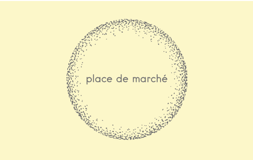

# Projet 6 - OpenClassrooms : CLASSIFIEZ AUTOMATIQUEMENT DES BIENS DE CONSOMMATION

<u>*Auteur : Maxime SCHRODER*</u>

## Contexte

  

Vous êtes Data Scientist au sein de l’entreprise "Place de marché”, qui souhaite lancer une marketplace e-commerce.

Sur la place de marché, des vendeurs proposent des articles à des acheteurs en postant une photo et une description.

Pour l'instant, l'attribution de la catégorie d'un article est effectuée manuellement par les vendeurs, et est donc peu fiable. De plus, le volume des articles est pour l’instant très petit.

Pour rendre l’expérience utilisateur des vendeurs (faciliter la mise en ligne de nouveaux articles) et des acheteurs (faciliter la recherche de produits) la plus fluide possible, et dans l'optique d'un passage à l'échelle, il devient nécessaire d'automatiser cette tâche.

## Données

Les données sont disponibles à l'adresse suivante: https://s3-eu-west-1.amazonaws.com/static.oc-static.com/prod/courses/files/Parcours_data_scientist/Projet+-+Textimage+DAS+V2/Dataset+projet+pre%CC%81traitement+textes+images.zip 

## Mission 
1. Etude de fasaibilité de classification des produtis : 
    - A partir des données textuelles : 
        - Analyse exploratoire 
        - Pré-traitement des textes
        - Mise en oeuvre de différentes méthodes d'extraction de features
    - A partir des images : 
        - Analyse exploratoire
        - Pré-traitement des images  
        - Mise en oeuvre de différentes méthodes d'extraction de features
    - Combinaison texte + image : utilisation des meilleurs modèles trouvés précédemment

2. Classification supervisée des produits : 
    - A partir uniquement des images : 
        - Extraction de features à partir du meilleur modèle trouvé lors de l'étude de fasabilité
        - Classification par 3 méthodes : CNN, RandomForestClassifier, KNNClassifier. 
    - Mise en place d'une data augmentation pour l'amélioration des performances du modèle

3. Test de la collecte de produits à base de “champagne” à partir d'une API (https://rapidapi.com/edamam/api/edamam-food-and-grocery-database)

## Construction

Dans ce dépôt, vous trouverez :
1. Le notebook d'analyse exploratoire et d'étude de faisabilité de classification sur les données textuelles: Notebook_1_NLP_faisabilite.ipynb
2. Le notebook d'analyse exploratoire et d'étude de faisabilité de classification sur les données images : Notebook_2_images_faisabilite.ipynb
3. Le notebook de l'étude de faisabilité en combinant le texte et les images : Notebook_3_texte+image_fasabilite.ipynb
4. Le notebook de l'étude de la classification supervisée à partir des images : Notebook_4_classification_supervisee_image.ipynb
5. Le script python pour l'extraction des produits à base de champagne de l'API : Extraction_produits_champagne.py
6. Le dossier contenant les scirpts python des fonctions utilisées dans les notebook : fonctions/
4. Le support de présentation : Présentation.pdf
5. Le logo de la société : logo_place_de_marche.png
6. Le fichier contenant les dépendances nécessaires : requirements.txt